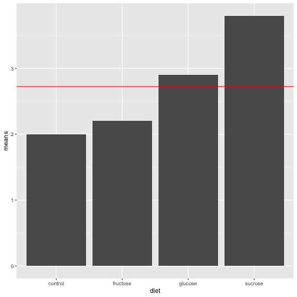

Formal ANOVA II
========================================================
author: Prof Randi Garcia
date: January 13, 2021
autosize: true
transition: linear
transition-speed: default
font-family: 'Helvetica'


Reading contemplation question
========================================================
  1. What kinds of values are contained in an ANOVA table (like the one on p. 76)? From where do we get these 
     different values? (you might not know all of the details yet--get to know your own blind spots!)

Announcements
========================================================

- HW3 due tomorrow at 11:55p
  - Try to submit as PDF file
- MP1 survey due for pre-approval Mon 9:20a  
- HW4 due on Tuesday 9:20a

Agenda
========================================================

- CA-SINZ Assumptions in assembly line code
- Formally present Analysis of variance (ANOVA)

Warm up - Gender Bias in STEM
=======================================================

In a randomized double-blind study (n = 127), science faculty from research-intensive universities rated the application materials of an applicant who was randomly assigned either a male or female name for a laboratory manager position. Faculty participants rated the male applicant as significantly more competent than the (identical) female applicant. These participants also selected a higher starting salary and offered more hypothetical career mentoring to the male applicant. [See materials here](http://www.pnas.org/content/suppl/2012/09/16/1211286109.DCSupplemental/pnas.201211286SI.pdf#nameddest=STXT)

C. Constant effects
=======================================================

We assume every observation in a similar condition is affected exactly the same. (Gets the same true score).  

For example,


```r
animals_sim <- animals %>%
  mutate(benchmark = mean(calm)) %>%
  group_by(animal) %>%
  mutate(animal_mean = mean(calm),
         aminal_effect = animal_mean - benchmark) #every "dog" observation gets the same effect
```

A. Additive effects
=======================================================

We add the effects as we go down the assembly line. 

All effects are **added** on. 


```r
calm_sim = benchmark 
         + aminal_effect 
         + cue_effect 
         + interaction_effect 
         + student_effect 
```

S. Same standard deviations
=======================================================

The piece of code for adding error is not dependent on which condition the observations is in. Every condition gets the **same** standard deviation, here 0.65.


```r
 + rnorm(68, 0, 0.68) #rnorm(n, mean, sd = 0.65)
```

I. Independent residuals
=======================================================

Takes 68 independent draws from a normal distribution.


```r
 + rnorm(68, 0, 0.68) #rnorm function assumes independence
```

N. Normally distributed residuals
=======================================================

It's `rnorm()`, and not `rbinom()` or `rpois()`...


```r
 + rnorm(64, 0, 0.68)
```

Z. Zero mean residuals
=======================================================

The second argument is the mean.


```r
 + rnorm(64, 0, 0.68) #rnorm(n, mean = 0, sd)
```

Leafhopper survival
=======================================================
It is reasonable to assume that the structure of a sugar molecule has something to do with its food value.
An experiment was conducted to compare the effects of four sugar diets on the survival of leafhoppers. The four diets were glucose and fructose (6-carbon atoms), sucrose (12-carbon), and a control (2% agar). The experimenter prepared two dishes with each diet, divided the leafhoppers into eight groups of equal size, and then randomly assigned them to dishes. Then she counted the number of days until half the insects had died in each group.

Decomposing the data
=======================================================

| control| sucrose| glucose| fructose|
|-------:|-------:|-------:|--------:|
|     2.3|     3.6|     3.0|      2.1|
|     1.7|     4.0|     2.8|      2.3|

- Draw the factor diagram, including the benchmark and residuals.

Leafhoppers
=======================================================

Bar graph of treatment condition averages. 



***

- We need to start thinking about if those differences in treatment means are real, or could possibly be due to chance error. 
- To your factor diagram, let's add in the benchmark, the effects for diet, and the residuals

|X.    | control| sucrose| glucose| fructose|
|:-----|-------:|-------:|-------:|--------:|
|      |     2.3|     3.6|     3.0|      2.1|
|      |     1.7|     4.0|     2.8|      2.3|
|means |     2.0|     3.8|     2.9|      2.2|

Analysis of Variance ANOVA
=======================================================
Formal ANOVA starts with the simple idea that we can compare our estimate of **treatment effect variability** to our estimate of **chance error variability** to measure how large our treatment effect is. 

Variability in treatment effects = True Effect Differences + Error

Variability in residuals = Error

Variability in treatment effects/Variability in residuals

- If our null hypothesis is, ${H}_{0}$: True Effect Differences $=0$, then what would we expect the following ratio to equal?


Sum of Squares (SS)
=======================================================
ANOVA measures variability in treatment effects with the sum of squares (SS) divided by the number of units of unique information (df). For the BF[1] design,

$${SS}_{Treatments} = n\sum_{i=1}^{a}(\bar{y}_{i.}-\bar{y}_{..})^{2}$$

$${SS}_{E} = \sum_{i=1}^{a}\sum_{j=1}^{n}({y}_{ij}-\bar{y}_{i.})^{2}$$

$${SS}_{Total} = {SS}_{Treatments} + {SS}_{E}$$

where $n$ is the group size, and $a$ is the number of treatments.

Degrees of Freedom (df)
=======================================================
The df for a table equals the number of free numbers, the number of slots in the table you can fill in before the pattern of repetitions and adding to zero tell you what the remaining numbers have to be. 

$${df}_{Treatments}=a-1$$

$${df}_{E}=N-a$$

Mean Squares (MS)
=======================================================
The ultimate statistic we want to calculate is Variability in treatment effects/Variability in residuals.

**Variability in treatment effects**:
$${MS}_{Treatments}=\frac{{SS}_{Treatments}}{{df}_{Treatments}}$$

**Variability in residuals**
$${MS}_{E}=\frac{{SS}_{E}}{{df}_{E}}$$


F-ratios and the F-distribution
=======================================================
The ratio of these two MS's is called the F ratio. The following quantity is our test statistic for the null hypothesis that there are no treatment effects.

$$F = \frac{{MS}_{Treatments}}{{MS}_{E}}$$

If the null hypothesis is true, then F is a random variable $\sim F({df}_{Treatments}, {df}_{E})$. The [F-distribution](https://en.wikipedia.org/wiki/F-distribution).


```r
qplot(x = rf(500, 3, 4), geom = "density")
```

Inference Testing in ANOVA
=======================================================

${H}_{0}:\tau_1=\tau_2=\tau_3=\tau_4$

We can find the p-value for our F calculation with the following code


```r
pf(17.67, 3, 4, lower.tail = FALSE)
```

<!-- DO FULL ANOVA TABLE ON BOARD FOR LEAFHOPPERS -->

Inside-outside Factors
=======================================================
- We cannot always use the same formula for the treatment effects. It depends on inside and outside factors
- Estimated effect for a factor = Average for the factor - sum of estimated effects for all outside factors. That is,

$$Effect = Average - Partial Fit$$

- One factor is *inside* another if each group of the first (inside) fits completely inside some group of the second (outside) factor.


