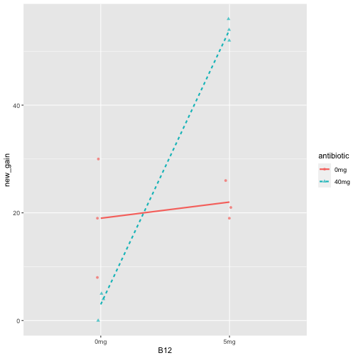
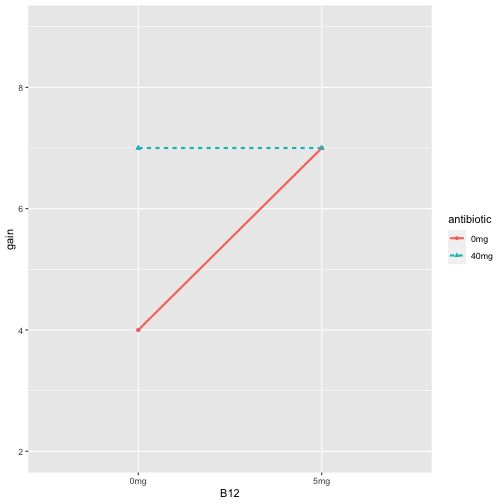
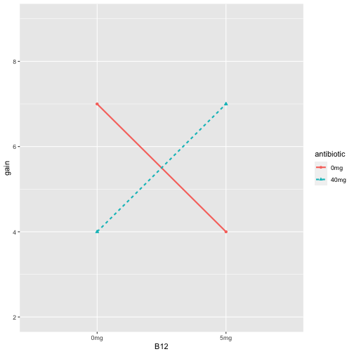
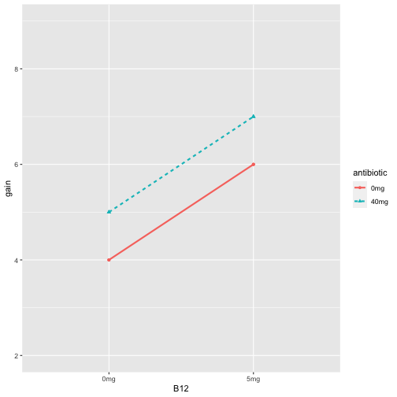
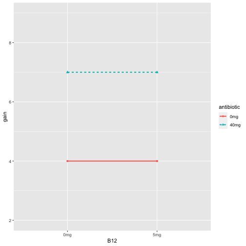

Two-Way Basic Factorial Design
========================================================
author: Prof Randi Garcia
date: January 20, 2021
autosize: true
transition: linear
transition-speed: default
font-family: 'Helvetica'


Reading contemplation question
========================================================

  1. Draw a factor diagram for your MP1 study (in expanded form). Lable all of your factors
  2. Indicated inside and outside factors by drawing arrows from inside factors to the outside factors.

Announcements
========================================================

- HW5 due on Thursday at 11:55p
  - Please print or type your answers.
- MP1 now due on Tues 1/26
   - Data analysis session tonight!
- **NEW** Thursday 8-8:30a office hours
  - Sign up for office hours [here](https://randigarcia.youcanbook.me/)

Agenda
========================================================

- ANOVA for the BF[1] Design in R
- BF[2] Design    


Sum of Squares (SS)
=======================================================
ANOVA measures variability in treatment effects with the sum of squares (SS) divided by the number of units of unique information (df). For the **BF[1] design**,

$${SS}_{Treatments} = n\sum_{i=1}^{a}(\bar{y}_{i.}-\bar{y}_{..})^{2}$$

$${SS}_{E} = \sum_{i=1}^{a}\sum_{j=1}^{n}({y}_{ij}-\bar{y}_{i.})^{2}$$

$${SS}_{Total} = {SS}_{Treatments} + {SS}_{E}$$

where $n$ is the group size, and $a$ is the number of treatments.

Degrees of Freedom (df)
=======================================================
The df for a table equals the number of free numbers, the number of slots in the table you can fill in before the pattern of repetitions and adding to zero tell you what the remaining numbers have to be. 

$${df}_{Treatments}=a-1$$

$${df}_{E}=N-a$$

Mean Squares (MS)
=======================================================
The ultimate statistic we want to calculate is Variability in treatment effects/Variability in residuals.

**Variability in treatment effects**:
$${MS}_{Treatments}=\frac{{SS}_{Treatments}}{{df}_{Treatments}}$$

**Variability in residuals**
$${MS}_{E}=\frac{{SS}_{E}}{{df}_{E}}$$


F-ratios and the F-distribution
=======================================================
The ratio of these two MS's is called the F ratio. The following quantity is our test statistic for the null hypothesis that there are no treatment effects.

$$F = \frac{{MS}_{Treatments}}{{MS}_{E}}$$

If the null hypothesis is true, then F is a random variable $\sim F({df}_{Treatments}, {df}_{E})$. The [F-distribution](https://en.wikipedia.org/wiki/F-distribution).


```r
qplot(x = rf(500, 3, 4), geom = "density")
```

Inference Testing in ANOVA
=======================================================

${H}_{0}:\tau_1=\tau_2=\tau_3=\tau_4$

We can find the p-value for our F calculation with the following code


```r
#for leafhoppers diet factor f-statistic
pf(17.67, 3, 4, lower.tail = FALSE)
```

<!-- DO FULL ANOVA TABLE ON BOARD FOR LEAFHOPPERS -->

ANOVA Source Table for BF[1]
=======================================================

- Using algebraic Notation

$${y}_{ij}=\mu+{\alpha}_{i}+{e}_{ij}$$

$${H}_{0}:{\alpha}_{1}={\alpha}_{2}=...={\alpha}_{a}$$

| Source | SS | df | MS | F | 
|------:|:-----:|:-----:|:------:|:------:|
| Treatment | $n\sum_{i=1}^{a}(\bar{y}_{i.}-\bar{y}_{..})^{2}$ | $a-1$ | $\frac{{SS}_{Treatments}}{{df}_{Treatments}}$ | $\frac{{MS}_{Treatments}}{{MS}_{E}}$ |
| Error | $\sum_{i=1}^{a}\sum_{j=1}^{n}({y}_{ij}-\bar{y}_{i.})^{2}$ | $N-a$ | $\frac{{SS}_{E}}{{df}_{E}}$ | |

ANOVA in R
=======================================================

- Analyzing the leafhopper data in R. [code here](https://randilgarcia.github.io/sds290interterm21/lectures/05_formal_anova.Rmd)

Basic Factorial Two-Way BF[2]
====================================
type: section

Piglets
=======================================================
It seems natural to think that adding the right vitamins to a pig's diet might produce fatter pigs faster. You've decided to study the effects of B12 in two doses (0mg and 5mg).  But pigs have bacteria living in their intestines that might prevent the uptake of vitamins, so you decided to give antibiotics to the pigs in one of two doses (0mg or 40 mg). You design your experiment in such a way that 3 piglets are randomly assigned to each of the 4 treatment conditions. You measure their weight every day, and take each pig's average daily weight gain as your final number recorded.  

Principal of Factorial Crossing
=======================================================

Two sets of treatments are **crossed** if all possble combinations of treatments occur in the design. The design in called a **two-way factorial** if there are two factors that are crossed, and it is then said to have a **factorial treatment structure**. 

Research Questions in a BF[2] Design
=======================================================

1. **Does treatment A have an effect on the response variable?** (Is there a main effect of factor 1?)
2. **Does treatment B have an effect on the response variable?** (Is there a main effect of factor 2?)
3. **Does being in a specific combination of treatments have an effect over and above 
   the additive effects of treatment A and B alone?** (Is there an interaction between factor 1 and factor 2? Is the effect of factor 1 different across levels of factor 2?) 

Interaction Mantra
=======================================================

An interaction is present if the effect of one factor is different across levels of the other factor. 



Interaction Graphs
=======================================================

For each of the following interaction graphs, answer the following questions with **YES** or **NO**.

1. Is there a main effect of B12?
2. Is there a main effect of antibiotics?
3. Is there an interaction between B12 and antibiotics?

Practice 1
=======================================================



Practice 1
=======================================================


***

1. YES
2. YES
3. YES

Practice 2
=======================================================


Practice 2
=======================================================



***

1. NO
2. NO
3. YES

Practice 3
=======================================================



Practice 3
=======================================================


***

1. YES
2. YES
3. NO

Practice 4
=======================================================



Practice 4
=======================================================


***

1. NO
2. YES
3. NO

