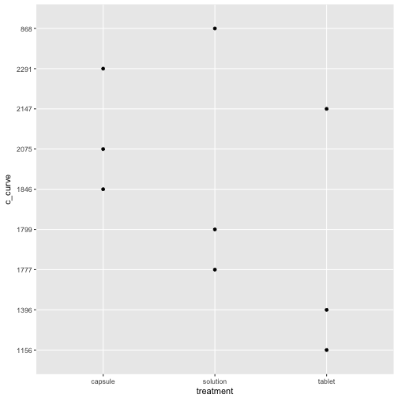
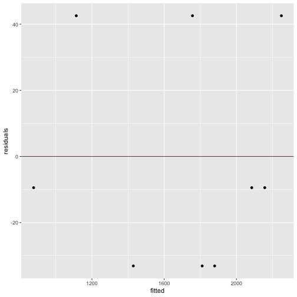

Split Plot/Repeated Measures Design II
========================================================
author: Prof Randi Garcia
date: February 1, 2021
autosize: true
transition: linear
transition-speed: default
font-family: 'Helvetica'


Reading contemplation question
========================================================

  1. There are two types of error in a split plot design. Explain the kids on boats 
     analogy from page 277. Which type of error is represented by what movement in 
     the analogy?
  
Reading Answer
========================================================

  1. There are two movements, the boats moving on the water, and the children moving 
     on the ships. The boat movement is the block variance, and the children's 
     movement is the residual variance. 
  
Announcements
========================================================

- Quiz1 grades posted; *most* MP1 grades posted
- MP2 pre-approval due Friday
  - Changes to mp2 requirements!
- HW6 is due tomorrow morning
  - Sign up for [office hours](https://randigarcia.youcanbook.me/)
- HW7 due on Thurs at 11:55p
  - Come with questions to tonight's session
  - RE CH 7: A1-A3, A6, B5-B6, C1-C3, C6-C9
  - C2 example on p. 240

Agenda
======================================================== 

- MP1 feedback
- Latin Square design
- Split plot designs
  - Crossing versus nesting

MP1
======================================================== 

- Directional hypotheses please.
- Dealing with floor effects and ceiling effects.
- Issue with confusing the N assumption and S assumption.
- Interpret your results in context please. 
- If something goes wrong with data collection or the design, give a full
description/explanation of what went wrong and why. 
- Please proof read. Utilize the [Jacobson center](https://www.smith.edu/academics/jacobson-center)!

Bioequivalence of drug delivery
=======================================================

This experiment is interested in the blood concentration of a drug after it has been administered. The concentration will start at zero, then go up, and back down as it is metabolized. This curve may differ depending on the form of the drug (a solution, a tablet, or a capsule). We will use three subjects, and each subject will be given the drug three times, once for each method. The area under the time-concentration curve is recorded for each subject after each method of drug delivery.  

Latin Square Design
=======================================================
In the bioequivalence example, because the body may adapt to the drug in some way, each drug will be used once in the first period, once in the second period, and once in the third period.

- We can use a Latin Square design to control the order of drug administration
- In this way, time is a second blocking factor (subject is the first)

 

Latin Square Design
=======================================================

Treatments: 
- Solution is treatment A
- Tablet is treatment B
- Capsule is treatment C


|          |period 1 |period 2 |period 3 |
|:---------|:--------|:--------|:--------|
|subject 1 |A 1799   |C 2075   |B 1396   |
|subject 2 |C 1846   |B 1156   |A 868    |
|subject 3 |B 2147   |A 1777   |C 2291   |

Factor diagram for the Latin Square

Latin Square Design
=======================================================

The actual data structure for analysis is "long" format


|subject |treatment |period |group |c_curve |
|:-------|:---------|:------|:-----|:-------|
|1       |solution  |1      |A     |1799    |
|1       |capsule   |2      |C     |1846    |
|1       |tablet    |3      |B     |2147    |
|2       |capsule   |1      |C     |2075    |
|2       |tablet    |2      |B     |1156    |
|2       |solution  |3      |A     |1777    |
|3       |tablet    |1      |B     |1396    |
|3       |solution  |2      |A     |868     |
|3       |capsule   |3      |C     |2291    |

Informal ANOVA for Latin Square
=======================================================

We can make a parallel dot graph



***

And check for equal standard deviations


```r
library(mosaic)

sd <- favstats(c_curve ~ treatment, data = bioequivalence)[,8]

max(sd)/min(sd)
```

```
[1] 2.387418
```


Formal ANOVA for the Latin Square
=======================================================

$${y}_{ijk}={\mu}+{\alpha}_{i}+{\beta}_{j}+{\tau}_{k}+{e}_{ijk}$$

- ${\mu}$ is the benchmark
- ${\alpha}_{i}$ is the row effect
- ${\beta}_{j}$ is the column effect
- ${\tau}_{k}$ is the treatment effect
- There are p rows, columns, and treatments

| Source | SS | df | MS | F |
|------:|:-----:|:-----:|:------:|:------:|
| rows | $\sum_{i=1}^{p}p(\bar{y}_{i..}-\bar{y}_{...})^{2}$ | $p-1$ | $\frac{{SS}_{A}}{{df}_{A}}$ | $\frac{{MS}_{A}}{{MS}_{E}}$ |
| columns | $\sum_{j=1}^{p}p(\bar{y}_{.j.}-\bar{y}_{...})^{2}$ | $p-1$ | $\frac{{SS}_{B}}{{df}_{B}}$ | $\frac{{MS}_{B}}{{MS}_{E}}$ |
| treatment | $\sum_{k=1}^{p}p(\bar{y}_{..k}-\bar{y}_{...})^{2}$ | $p-1$ | $\frac{{SS}_{T}}{{df}_{T}}$ | $\frac{{MS}_{T}}{{MS}_{E}}$ |
| Error | $\sum_{i=1}^{p}\sum_{j=1}^{p}({y}_{ijk}-\bar{y}_{i..}-\bar{y}_{.j.}-\bar{y}_{..k}+2\bar{y}_{..})^{2}$ | $(p-1)(p-2)$ | $\frac{{SS}_{E}}{{df}_{E}}$ | |


Formal ANOVA for the Latin Square
=======================================================


```r
ls_mod <- lm(c_curve ~ treatment + period + subject, data = bioequivalence)

anova(ls_mod)
```

```
Analysis of Variance Table

Response: c_curve
          Df Sum Sq Mean Sq F value   Pr(>F)   
treatment  2 608891  304445  67.733 0.014549 * 
period     2 928006  464003 103.231 0.009594 **
subject    2 261115  130557  29.047 0.033282 * 
Residuals  2   8990    4495                    
---
Signif. codes:  0 '***' 0.001 '**' 0.01 '*' 0.05 '.' 0.1 ' ' 1
```


Residual Plot
=======================================================


```r
bioequivalence <- bioequivalence %>%
  mutate(fitted = fitted(ls_mod), 
         residuals = residuals(ls_mod))

ggplot(bioequivalence, aes(x = fitted, residuals)) +
  geom_point() +
  geom_hline(yintercept = 0, color = "red")
```

Residual Plot
=======================================================



Tulips
========================================================

How would you conduct this study?

A plant breeder wishes to study the effects of soil drainage and variety of tulip bulbs on flower production. Twelve 3m by 10m experimental sites are available in the test garden--each is a .5m deep trench. You can manipulate soil drainage by changing the ratio of sand to clay for the soil you put in a trench. After talking to your collaborator, you decided that four different levels of soil drainage would suffice. You'll be testing 15 different types of tulips, and measuring flower production in the spring.

Split Plot Design
=======================================================

If you suspect a design in a split-plot design, you should be able to answer the following questions:

1. What are the whole plots, that is, what is the blocking factor?
2. What is the between-blocks factor? Is it observational or experimental?
3. What is the within-blocks factor? Is it observational or experimental? 

Example: Tulips
========================================================
A plant breeder wishes to study the effects of soil drainage and variety of tulip bulbs on flower production. Twelve 3m by 10m experimental sites are available in the test garden--each is a .5m deep trench. You can manipulate soil drainage by changing the ratio of sand to clay for the soil you put in a trench. After talking to your collaborator, you decided that four different levels of soil drainage would suffice. You'll be testing 15 different types of tulips, and measuring flower production in the spring.

Crossing versus Nesting
=======================================================

1. **Crossing**: Two sets of treatments are crossed if all possible combinations of treatments occur in the design. The design is called a two-way factorial and has factorial treatment structure. 
2. **Nesting**: One factor is nested within another if each level of the first ("inside") factor occurs with exactly one level of the second ("outside") factor.

Example: Diabetic Dogs
=======================================================

The disease diabetes affects the rate of turnover of lactic acid in a system of biochemical reactions called the Cori cycle. This experiment compares two methods of using radioactive carbon-14 to measure rate of turnover. Method 1 is injection all at once, and method 2 is infused continuously. 10 dogs were sorted into two groups, 5 were controls and 5 had their pancreas removed (to make it diabetic). The rate of turnover was then measured twice for each dog, once for each method. The order of the two methods was randomly assigned. 

Draw the factor diagram for the data on page 263. 

Split Plot/Repeated Measures Design
=======================================================


- Can use **split plot** language if blocking is created by sub-dividing blocks 
  (whole plot and subplot factors)
- We can use the **repeated measures** language if blocking is created by reusing 
  subjects/material (within and between subjects factors)
- We can always use the terms **blocks** and **within-blocks** terminology


Formal ANOVA for the Split Plot Design
=======================================================

$${y}_{ijk}={\mu}+{\alpha}_{i}+{\beta}_{j(i)}+{\gamma}_{k}+({\alpha\gamma})_{ik}+{e}_{ijk}$$

- ${\mu}$ is the benchmark
- ${\alpha}_{i}$ effect of level i of the between-blocks factor, $i$ from $1$ to $a$
- ${\beta}_{j(i)}$ effect of block $j$ (for level $i$ of the between block factor), $j$ from $1$ to $n$
- ${\gamma}_{k}$ effect of level $k$ of the within-block factor, $k$ from $1$ to $t$
- $({\alpha\gamma})_{ik}$ interaction effect for level $i$ of the between-blocks factor with level $k$ of the within-blocks factor

Formal ANOVA for the Split Plot Design
=======================================================

| Source | SS | df | MS | F |
|------:|:-----:|:-----:|:------:|:------:|
| Between | $t\frac{N}{a}\sum_{i=1}^{a}(\bar{y}_{i..}-\bar{y}_{...})^{2}$ | $a-1$ | $\frac{{SS}_{A}}{{df}_{A}}$ | $\frac{{MS}_{A}}{{MS}_{B}}$ |
| Blocks | $t\sum_{i=1}^{a}\sum_{j=1}^{n}(\bar{y}_{ij.}-\bar{y}_{i..})^{2}$ | $N-a$ | $\frac{{SS}_{B}}{{df}_{B}}$ | $\frac{{MS}_{B}}{{MS}_{E}}$ |
| Within | $Na\sum_{k=1}^{K}(\bar{y}_{..k}-\bar{y}_{...})^{2}$ | $t-1$ | $\frac{{SS}_{T}}{{df}_{T}}$ | $\frac{{MS}_{T}}{{MS}_{E}}$ |
| Interaction | $\sum_{i=1}^{a}\sum_{k=1}^{t}\frac{N}{a}(\bar{y}_{i.k}-\bar{y}_{i..}-\bar{y}_{..k}+\bar{y}_{...})^{2}$ | $(a-1)(t-1)$ | $\frac{{SS}_{AT}}{{df}_{AT}}$ | $\frac{{MS}_{AT}}{{MS}_{E}}$ |
| Error | $\sum_{i=1}^{a}\sum_{j=1}^{N}\sum_{k=1}^{t}({y}_{ijk}-\bar{y}_{i.k}-\bar{y}_{.j.}-\bar{y}_{..k}+\bar{y}_{i..})^{2}$ | $(N-a)(t-1)$ | $\frac{{SS}_{E}}{{df}_{E}}$ | |

Analysis in R
=======================================================

[See r code](lectures/13_spitplot_design_inR.Rmd)

<!-- Scatterplots for Within-Blocks Factors -->
<!-- ======================================================= -->

<!-- ```{r, echo=FALSE} -->
<!-- library(tidyr) -->
<!-- library(dplyr) -->
<!-- library(knitr) -->

<!-- tree <- c(rep("tree1",3), rep("tree2",3), rep("tree3", 3),rep("tree4", 3), rep("tree5", 3)) -->
<!-- treatment <- rep(c("water", "spores", "oil"), 5) -->
<!-- bugs_change <- c(-9, -4, 4, 18, 29, 29, 10, 4, 14, 9, -2, 14, -6, 11, 7) -->

<!-- mealybugs <- data.frame(tree, treatment, bugs_change) -->
<!-- ``` -->

<!-- ```{r} -->
<!-- mealybugs -->
<!-- ``` -->

<!-- Informal Analysis Structure -->
<!-- ======================================================= -->

<!-- ```{r} -->
<!-- library(tidyr) -->
<!-- library(ggplot2) -->

<!-- mealybugs %>% -->
<!--   spread(treatment, bugs_change) -->
<!-- ``` -->

<!-- Scatterplots -->
<!-- ======================================================= -->

<!-- Spores versus oil -->

<!-- ```{r} -->
<!-- mealybugs %>% -->
<!--   spread(treatment, bugs_change) %>% -->
<!--   ggplot(aes(x = spores, y = oil)) + -->
<!--   geom_point() + -->
<!--   geom_abline(slope = 1, intercept = 8) -->
<!-- ``` -->

<!-- Scatterplots -->
<!-- ======================================================= -->

<!-- Spores versus water -->

<!-- ```{r} -->
<!-- mealybugs %>% -->
<!--   spread(treatment, bugs_change) %>% -->
<!--   ggplot(aes(x = spores, y = water)) + -->
<!--   geom_point() + -->
<!--   geom_abline(slope = 1, intercept = -5) -->
<!-- ``` -->

<!-- Scatterplots -->
<!-- ======================================================= -->

<!-- Oil versus water -->

<!-- ```{r} -->
<!-- mealybugs %>% -->
<!--   spread(treatment, bugs_change) %>% -->
<!--   ggplot(aes(x = oil, y = water)) + -->
<!--   geom_point() + -->
<!--   geom_abline(slope = 1, intercept = -13) -->
<!-- ``` -->

<!-- Split Plot Design -->
<!-- ======================================================= -->

<!-- If you suspect a design in a split-plot design, you should be able to answer the following questions: -->

<!-- 1. What are the whole plots, that is, what is the blocking factor? -->
<!-- 2. What is the between-blocks factor? Is it observational or experimental? -->
<!-- 3. What is the within-blocks factor? Is it observational or experimental?  -->

<!-- Tulips -->
<!-- ======================================================== -->
<!-- A plant breeder wishes to study the effects of soil drainage and variety of tulip bulbs on flower production. Twelve 3m by 10m experimental sites are available in the test garden--each is a .5m deep trench. You can manipulate soil drainage by changing the ratio of sand to clay for the soil you put in a trench. After talking to your collaborator, you decided that four different levels of soil drainage would suffice. You'll be testing 15 different types of tulips, and measuring flower production in the spring. -->

<!-- Example from HW7: Parsnip Plants -->
<!-- ======================================================= -->

<!-- Under the control conditions of this study, wild parsnip plants averaged about a thousand seeds from their first set of flowers (primary umbels), about twice as many from the second set of flowers, but only about 250 from the third set. For plants attacked by the parsnip webworm, which destroyed most of the primary umbels, the pattern was quite different: the seed production from primary, secondary, and tertiary umbels averaged about 200, 2400, and 1300, respectively.  -->

<!-- Example: Diabetic Dogs -->
<!-- ======================================================= -->

<!-- The disease diabetes affects the rate of turnover of lactic acid in a system of biochemical reactions called the Cori cycle. This experiment compares two methods of using radioactive carbon-14 to measure rate of turnover. Method 1 is injection all at once, and method 2 is infused continuously. 10 dogs were sorted into two groups, 5 were controls and 5 had their pancreas removed (to make it diabetic). The rate of turnover was then measured twice for each dog, once for each method. The order of the two methods was randomly assigned.  -->


