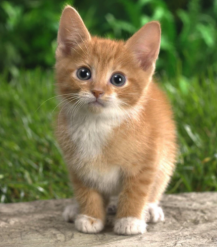
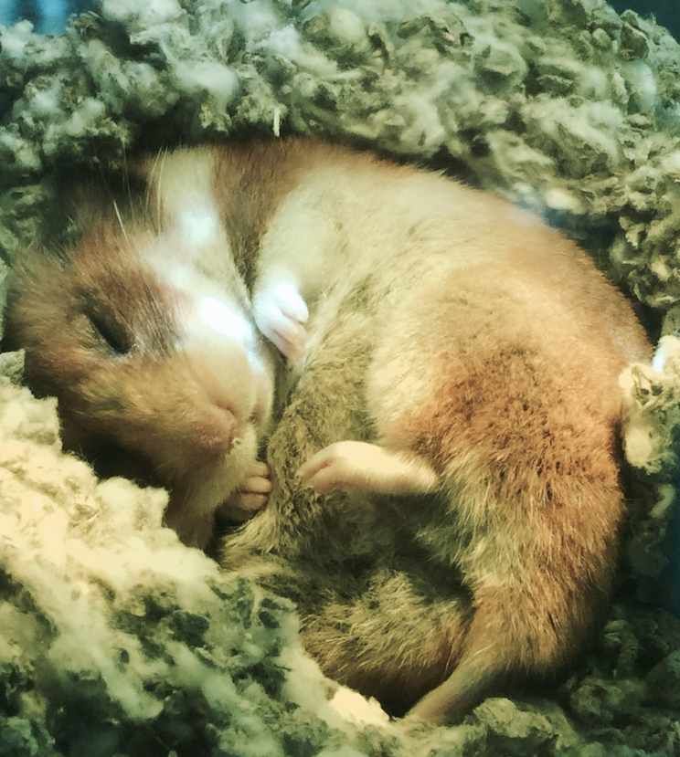
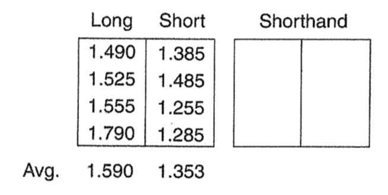
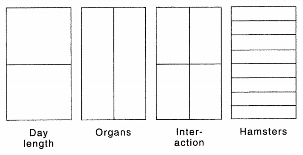

Four Basic Designs
========================================================
author: Prof Randi Garcia
date: January 5, 2021
autosize: true
transition: linear
transition-speed: default
font-family: 'Helvetica'

Reading contemplation question
========================================================

  1. Was this design principal of *crossing* present in Kelly's hamster experiment?

Announcements
========================================================

- Slack issues
- Registration

Our First Experiment
========================================================
incremental: true
Get in breakout groups of ~8 we will discuss. 

As you participate in the experiment at the link below, remember: 
- what you saw 
- what you did
- the order in which it happened. 

To participate, find the experiment link in the course schedule!!
**http://bit.ly/sds290interterm21**

Our First Experiment
========================================================
incremental: true
In your groups: 
- Take turns describing what you saw/did.
- Your objective, as a group, is to describe the FULL experimental design.

Discussion questions:
- What were all of the possibilities? How do you think that was determined?
- Which conditions were distributed *across* people, and which *within* people?
- What do you think are the possible research questions answered by this study?
        
        
What makes a study an "Experiment"?
========================================================
incremental: true
- Can you assign experimental material to conditions?
- You've created those conditions
- If the material alredy comes in different "varieties", then it's an *observational* study
    - People with different psychiatric illnesses
    - Different species of plants
- Sometimes one "study" will have both **experimental** and **observational** variables

========================================================

***

========================================================

***

Sources of Variability
=======================================================

Think about all of the reasons calmness scores may differ (vary).

1. Vary across conditions 
2. Vary because of measurement error
3. Vary because of experimental material (you!) differences

Kinds of Variability
=======================================================
incremental: true
1. Planned, systematic
2. Chance-like 
3. **Unplanned, systematic**

Unplanned, Systematic Variability
=======================================================
If we suspect there is unplanned, systematic variability, we should 
do what we can to turn it into planned, systematic, or chance-like variability
- Confounding variables
- Bias

Confounding Variables
=======================================================
I want to test if smelling a tasty food (fresh cinnamon rolls) versus a non-tasty food (broccoli) has an effect on salivation in humans. So, I recruit some participants to come to my lab, I'll have to bake the cinnamon rolls and run that condition all at once, so I decide that I will bake my rolls at 9a, then from 10a-12p I will run the cinnamon roll condition. I bring people into individual distraction free rooms, hook them up to the salivation sensor, then bring them a plate with a freshly baked cinnamon roll. I record their salivation. Then, I will run the broccoli from 1p-3p, using the same measurement procedure. 

Are there any confounding variables in my study?

Bias
=======================================================
Our data will be "off" in a systematic, non-random, way

- Sampling Bias: Biologist is using a net with large holes to capture a sample of fish from a lake. 
- Selection Bias: Assigning the skinnier rats to the good lab chow. 

Kelly's Hamster Study
=======================================================

***

Design Principal 1: Random Assignment
=======================================================

Design 1: Randomized Basic Factorial Design
- BF[1]  

Design Principal 2: Blocking
=======================================================

Design 2: One-Way Complete Block Design 
- CB[1]  

Design Principal 3: Factorial Crossing
=======================================================

Design 3: Two-Way Basic Factorial Design
- BF[2]

Kelly's Hamster Study
=======================================================

Blocking + Random Assignment + Crossing
=======================================================

Design 4: Split Plot/Repeated Measures Design
- SP/RM[1,1]

The Meats 
=======================================================
Randomized Basic Factorial Design BF[1]  

The shelf life of meats is the time a prepackaged cut remains salable, safe, and nutritious. Recent studies suggested controlled gas atmospheres as possible alternatives to existing packaging. To test this, beef steaks (75$g$) were randomly assigned to packaging with either 1) ambient air in a  commercial plastic wrap, 2) vacuum packed, 3) 100% carbon dioxide ($CO_2$), or 4) a mixture of 1% carbon monoxide (CO), 40% oxygen ($O_2$), and 59% nitrogen (N). The number of psychrotrophic bacteria on the meat was measured after nine days of storage at 4 degrees C.

<!-- Gender Bias in STEM -->
<!-- ======================================================= -->
<!-- Randomized Basic Factorial Design BF[1]   -->

<!-- In a randomized double-blind study (n = 127), science faculty from research-intensive universities rated the application materials of a student who was randomly assigned either a male or female name for a laboratory manager position. Faculty participants rated the male applicant as significantly more competent and hireable than the (identical) female applicant. These participants also selected a higher starting salary and offered more career mentoring to the male applicant. [See materials here](http://www.pnas.org/content/suppl/2012/09/16/1211286109.DCSupplemental/pnas.201211286SI.pdf#nameddest=STXT) -->

<!-- Acid Rain    -->
<!-- ======================================================= -->
<!-- Randomized Basic Factorial Design BF[1] -->

<!-- "Clean" precipitation has a pH in the 5.0 to 5.5 range, but observed precipitation pH in northern New Hampshire is often in the 3.0 to 4.0 range. Is this acid rain hurting trees? 240 six-week-old yellow birch seedlings were randomly assigned to one of 6 groups. Each group received an acid rain mist at the following pH levels: 4.7, 4.0, 3.3, 3.0, and 2.3. After 17 weeks, the seedling were weight, and their total plant (dry) weight was recorded.  -->

<!-- Inappropriate Insects -->
<!-- ======================================================= -->
<!-- One-Way Complete Block Design CB[1]   -->

<!-- Modern zoos try to reproduce natural habitats in their exhibits as much as possible. They try to use appropriate plants, but these plants can be infested with inappropriate insects. Cycads (plants that look vaguely like palms) can be infected with mealybugs, and the zoo wishes to test three treatments: 1) water, 2) horticultural oil, and 3) fungal spores in water. Five infested cycads are taken to to the testing area. Three branches are randomly selected from each tree, and 3 cm by 3 cm patches are marked on each branch. The number of mealybugs on the patch is counted. The three treatments then get randomly assigned to the three branches for each tree. After three days the mealybugs are counted again. The change in number of mealybugs is computed ($before-after$). -->

<!-- Radioactive Twins -->
<!-- ======================================================= -->
<!-- One-Way Complete Block Design CB[1]   -->

<!-- Most people believe that country air is better to breather than city air, but how would you test it? You might start by choosing a response that narrows down what you mean by "better." One feature of healthy lungs is tracheobronchial clearance---how fast they get rid of nasty stuff. To test this idea, investigators found 7 sets of mono-zygotic twins where one was living in the country and one in the city. Each person inhaled an aerosol of radioactive Teflon particles. Then the level of radioactivity was measured once right after inhaling, and again an hour later. The percent of the original radioactivity remaining was calculated.  -->

<!-- Swimsuit/Sweater Study -->
<!-- ======================================================= -->
<!-- Two-Way Basic Factorial Design BF[2] -->

<!-- Objectification theory (Fredrickson & Roberts, 1997) posits that American culture socializes women to adopt observers' perspectives on their physical selves. This self-objectification is hypothesized to (a) produce body shame, which in turn leads to restrained eating, and (b) consume attentional resources, which is manifested in diminished mental performance. An experiment manipulated self-objectification by having participants try on a swimsuit or a sweater. Further, it tested 42 women and 40 men and found that these effects on body shame and restrained eating replicated for women only. Additionally, self-objectification diminished math performance for women only.  -->

<!-- Creepy Animals -->
<!-- ======================================================= -->
<!-- Split Plot/Repeated Measures Design SP/RM[2,1] -->

<!-- The effects of exposure to images of different domestic animal species in either aggressive or submissive postures on mood was tested with a split-plot/repeated measure (or "mixed") design. Using a computer to randomize, participants were randomly assigned to either view images of dogs or images of cats. All participants saw both an aggressive animal and a submissive animal, and their moods were assessed via self-report after each image. The order of presentation (aggressive then submission, or submissive then aggressive) was randomized to control for order effects.  -->

