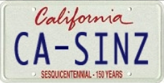

Formal ANOVA
========================================================
author: Prof Randi Garcia
date: January 12, 2021
autosize: true
transition: linear
transition-speed: default
font-family: 'Helvetica'


Reading Contemplation Question
========================================================

  1. Chapter 3 introduced how we will calculate the treatment effects. What do 
     we mean by "effect"?  

Announcements
========================================================

- HW2 due *right now*
- HW4 assigned - check website!
- Won't need it today, but here is the [Jamboard link](https://jamboard.google.com/d/1mmGtXITXmD908iyWsHCe3RO1TbxkuEjvavIUneLgZR4/edit?usp=sharing)

Agenda
========================================================

- Level of measurement of response variable
- Six Fisher Assumptions
- Informal ANOVA code: Assembly line metaphor

Notes on Mini Project 1
========================================================

- Giving your account an upgrade!
- Make sure your factors are *experimental*.
- Adding the "click consent" form.
- Pre-launch approval process.

What's Your Response?
========================================================
Categorical

- **nominal:** categorical variable whose levels have no ordering.
    - gender, race, etc.
- **ordinal:** categorical variable whose levels have an order. 
    - education level

What's Your Response?
========================================================
Numerical

- **interval:** numerical variable where we assume the distance between points is equal. No true zero.
    - scores on a “self-esteem” scale, measured from 1 to 7 
- **ratio:** numerical variable that has a true zero point. 
    - students’ times to complete cognitive task
    - enzyme concentration

Six Fisher Assumptions
=======================================================
type: section

Six Fisher Assumptions
=======================================================


***

- C. Constant effects
- A. Additive effects
- S. Same standard deviations
- I. Independent residuals
- N. Normally distributed residuals
- Z. Zero mean residuals

Parallel Dot Graphs
=======================================================

- See code **02-Informal ANOVA** from the course website
- [Link to code](https://randilgarcia.github.io/sds290interterm21/lectures/02_informal_anova.Rmd).

C. Constant effects
=======================================================

We assume every observation in a similar condition is affected exactly the same. (Gets the same true score).  

For example,


```r
animals_sim <- animals %>%
  mutate(benchmark = mean(calm)) %>%
  group_by(animal) %>%
  mutate(animal_mean = mean(calm),
         aminal_effect = animal_mean - benchmark) #every "dog" observation gets the same effect
```

A. Additive effects
=======================================================

We add the effects as we go down the assembly line. 

All effects are **added** on. 


```r
calm_sim = benchmark 
         + aminal_effect 
         + cue_effect 
         + interaction_effect 
         + student_effect 
```

S. Same standard deviations
=======================================================

The piece of code for adding error is not dependent on which condition the observations is in. Every condition gets the **same** standard deviation, here 0.65.


```r
 + rnorm(68, 0, 0.68) #rnorm(n, mean, sd = 0.65)
```

I. Independent residuals
=======================================================

Takes 68 independent draws from a normal distribution.


```r
 + rnorm(68, 0, 0.68) #rnorm function assumes independence
```

N. Normally distributed residuals
=======================================================

It's `rnorm()`, and not `rbinom()` or `rpois()`...


```r
 + rnorm(64, 0, 0.68)
```

Z. Zero mean residuals
=======================================================

The second argument is the mean.


```r
 + rnorm(64, 0, 0.68) #rnorm(n, mean = 0, sd)
```
